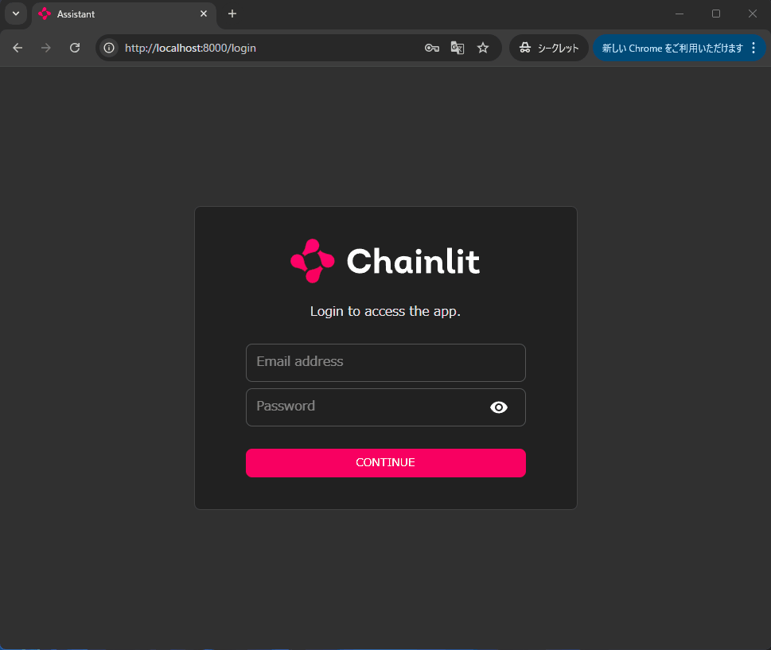
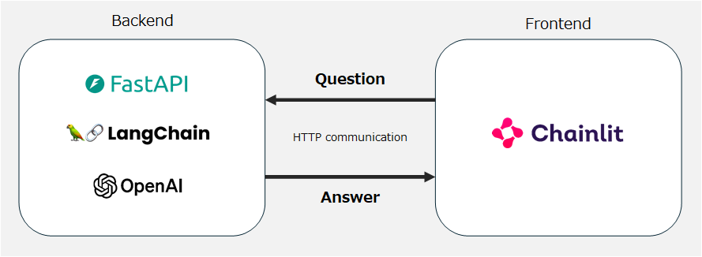

# AI チャットボット サンプルプロジェクト 🤖💬
このリポジトリでは、AIチャットボット開発について学べるサンプルプロジェクトを提供します。

最終的には、以下の機能を搭載したチャットボットアプリを作成します：  
- **会話記憶機能**：過去の会話を記録し、それに基づいた応答が可能です。
- **外部データ参照機能（RAG）**：外部のデータを活用して回答を生成します。
- **リアルタイム応答表示**：回答をリアルタイムで表示します。
- **簡易ログイン機能**：簡単なログイン機能でユーザーの識別を行います。

⚠️ 現在、このプロジェクトはβ版です。  
ソースコードの変更予定はありませんが、ドキュメントについては引き続き改善を行っていく予定です。  
プロジェクトをご利用いただく際には、最新のドキュメントを確認いただけると幸いです。

---

## 目次
1. [このプロジェクトで体験できること](#このプロジェクトで体験できること-) 🌟
2. [対象者](#対象者-️️) 🙋‍♀️🙋‍♂️
3. [開発プロセス](#開発プロセス-) 🚀
4. [使用技術](#使用技術-) 🪄
5. [GPT-4o-miniの料金について](#gpt-4o-miniの料金について-) 🪙
6. [動作確認環境](#動作確認環境-) ⛺
7. [事前準備](#事前準備-️) 🛠️

---

## このプロジェクトで体験できること 🌟
以下の内容を体験できます：  
- AIチャットボットの基本的な仕組みと実装方法
- Pythonを使用したウェブアプリケーション開発の流れ
- 最新のAI開発フレームワーク（LangChain, Chainlit）の活用
- 段階的な機能拡張によるアプリケーション開発プロセス

---

## 対象者 🙋‍♀️🙋‍♂️
こんな方におすすめです：  
- 🤖 AIチャットボットの基本を学びたい方
- 🐍 Pythonを使ったアプリ開発の流れを体験したい方
- 📚 FastAPIを活用したアプリ開発の基礎を学びたい方
- 🪜 段階的に機能を拡張していく開発プロセスを学びたい方
- 💻 LangChain、Chainlitなどの最新技術スタックに興味がある方

---

## 開発プロセス 🚀
このプロジェクトでは、段階的にチャットボットの機能を拡張していきます。  
各ステップで新しい機能を追加し、より高度なチャットボットを構築していきます。

### 実装ステップ
このプロジェクトは、以下の5つの主要な実装ステップで構成されています：
- 📁 **01_Basic**：シンプルな質問応答機能を実装
- 📁 **02_History**：過去の会話を記憶する機能を実装
- 📁 **03_RAG**：RAGを用いて外部知識を利用した回答生成機能を実装
- 📁 **04_Streaming**：回答をリアルタイム表示（ユーザー体験の向上目的）
- 📁 **05_Auth**：ログイン機能を実装

### プロジェクト構成
各実装ステップには、バックエンドとフロントエンドの開発環境が含まれています：

- 📁 `backend` - バックエンド開発用ディレクトリ
- 📁 `frontend` - フロントエンド開発用ディレクトリ

 

📝 補足情報：バックエンドとフロントエンドの分離について

このプロジェクトでは、バックエンドとフロントエンドを別々のディレクトリで管理しています。  
この構造を採用した主な理由は以下の通りです：

1. 機能の明確な分離：
   - サーバーサイドとクライアントサイドの責任を明確に分けることで、開発の複雑さを軽減します。
   - 各部分の役割が明確になり、コードの管理や理解が容易になります。

2. 将来的な拡張性：
   - 必要に応じて、バックエンドやフロントエンドのみを更新や拡張しやすくなります。
   - 例えば、フロントエンドのフレームワークを変更する際も、バックエンドに影響を与えずに行えます。

3. 最新の開発トレンドの体験：
   - マイクロサービスアーキテクチャなど、サービスを分離する最近のトレンドを小規模なプロジェクトで体験できます。

この方法は、効率的な開発と将来の拡張を容易にする一つのアプローチです。  
ただし、プロジェクトの規模や要件によって最適な構成は異なる場合があります。

---

## 使用技術 🪄
今回使用するフレームワークは以下の通りです：
- **LangChain**: 大規模言語モデルを使用したアプリケーション開発を支援するライブラリ
- **OpenAI API**: 質問に対する回答を生成するAIモデル
- **FastAPI**: 高速なAPI構築を可能にするPythonフレームワーク
- **Chainlit**: チャットインターフェースの構築を支援するフレームワーク

### 基本的なアーキテクチャ
基本的なアーキテクチャは以下のとおりです：  

- ユーザーからの質問はフロントエンド（Chainlit）で受け取ります。
- 質問はHTTP通信でバックエンドへ送信されます。
- バックエンド（FastAPI、LangChain、OpenAI）で回答を生成し、HTTP通信でフロントエンドに返信します。

### Chainilt について
今回のフロントエンド開発では、注目が高まりつつあるChainlitを採用しています。  
Chainlitは、チャットアプリケーション開発に特化した比較的新しいPythonフレームワークです。  
チャットボットの基本機能が予め用意されているため、スピーディーなプロトタイプの作成に適しています。  

Pythonには他にもStreamlitやGradioなど、人気のあるウェブフレームワークがあります。  
これらが汎用的なデータアプリケーション向けであるのに対し、  
Chainlitはチャットインターフェースに特化している点が特徴です。

---

## GPT-4o-miniの料金について 🪙
このサンプルプロジェクトではOpenAIの GPT-4o-mini モデルを使用します。  
GPT-4o-mini は非常に低コストではありますが、使用量に応じて料金がかかりますのでご注意ください。  

このサンプルプロジェクトの開発には、試行錯誤の作業を含めて約 ＄0.03 (約5円) かかりました。  
目安にしていただければと思います。

公式の料金表は以下の通りです：
- 入力トークン: **100万トークン** あたり **$0.150**
- 出力トークン: **100万トークン** あたり **$0.600**

100万トークン は約2,000ページの本に相当します。  
(1ページあたり約500文字と仮定)

最新情報については、[OpenAIのAPI料金一覧](https://openai.com/api/pricing/) を確認してください。

---

## 動作確認環境 ⛺
このサンプルプロジェクトは以下の環境で作成しました：  
- OS: Windows 11
- Python: 3.10.11
- CPU: Intel Core i9-10900KF
- GPU: 使用なし

軽量なアプリケーションとなっているので、ハイスペックPCではなくても動作します。  
Pythonバージョンについては、同じバージョンを使用することを推奨します。

---

## Let's get started! 💪

このプロジェクトに興味を持っていただき、ありがとうございます！  
挑戦してみたいと思った方は、一緒に次のステップに進んでいきましょう。

まずは事前準備から始めてみましょう。  
以下のリンクから事前準備ガイドにアクセスできます：

[事前準備ガイド](SETUP.md)

